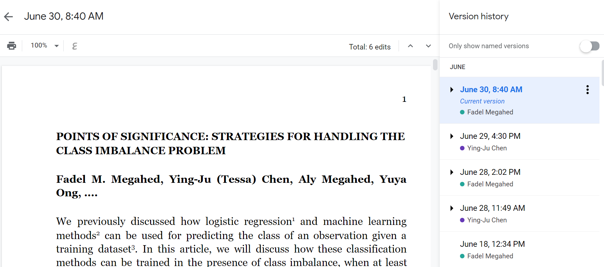

```{r setup, include=FALSE}
knitr::opts_chunk$set(cache = TRUE,
                      echo = TRUE,
                      warning = FALSE,
                      message = FALSE,
                      progress = FALSE, 
                      verbose = FALSE,
                      dev = 'png',
                      dpi = 600,
                      fig.retina = 2,
                      out.width = '100%')

options(htmltools.dir.version = FALSE)

miamired = '#84d6d3'

if(require(pacman)==FALSE) install.packages("pacman")
pacman::p_load(tidyverse, magrittr, emojifont, RefManageR,
               scales, plotly)

BibOptions(check.entries = FALSE, bib.style = "authoryear", 
           style = "markdown", dashed = TRUE)

bib = ReadBib("refs.bib")

```

```{r xaringan-themer, include=FALSE, warning=FALSE}
if(require(xaringanthemer) == FALSE) install.packages("xaringanthemer")
library(xaringanthemer)
style_mono_accent(base_color = "#84d6d3")

```


# Learning Objectives for Today's Class

- Explaining what is **version control** and why should you use it?  

- Understanding the **setup process for version control** using Git:    
  * Register for a [GitHub](https://github.com) account. 
  * Installing [Git](https://happygitwithr.com/install-git.html) on your computer. 
  * Installing a Git Client

- Explaining what common **Git** commands mean.  

- Creating a **repo**, **tracking changes** and exploring a **file's history**.  

- Sharing information on the web (i.e., **remotes** -- we will use GitHub)

- **Collaborating** with other people.

- Connecting **RStudio to Git and GitHub**

- Running an example. 


---
class: inverse, center, middle

# Automated Version Control

---

```{r notFinal1, echo=FALSE, fig.align='center', fig.cap="Source: www.phdcomics.com | title: 'notFinal.doc' | originally published: 10/12/2012", out.width = "40%", out.height = "40%"}
knitr::include_graphics("figures/phd101212s.png")
```

**Note while this looks like a comic, many of the people in my generation did and experienced this.** `r emojifont::emoji(emojifont::search_emoji('frown'))[3]`

---

# Manual Version Control: A Personal Example

```{r notFinal2, echo=FALSE, fig.align='center', fig.cap="Working on my first research grant. This is an example of both version control and commiting to a remote server.", out.width = "100%", out.height = "100%"}
knitr::include_graphics("figures/priorToGit.PNG")
```

**I am the first to admit that this was a RIDICULOUS system.**

---

# Embedded Version Control [1]

```{r embedded1, echo=FALSE, fig.align='center', fig.cap="A recent research project in Word.", out.width = "50%", out.height = "50%"}
knitr::include_graphics("figures/embeddedVersionControl1.PNG")
```

**What are two limitations of track changes in a word document?**

---

# Embedded Version Control [2]

```{r embedded2, echo=FALSE, fig.align='center', fig.cap="A recent research project in Google Docs.", out.width = "90%", out.height = "90%"}

```

**A better approach for handling version control for word-processor type documents.**

---

# Version Control Systems

For flat (i.e., code, CSV, .txt) files, version control systems capture a **base version of the file** and record your progress as you progress. Unlike a Google Doc, the recording of progress/milestones have to be initiated by **YOU** through **commits**. 

## Some Characteristics

The following characteristics are based on the excellent introduction by `r Citet(bib, "huang2016automated")`.

- You can think of the **track changes** as the process of recording different versions of our files.  

--

- You decide which changes will be made to the next version (each record of these changes is called a **commit**), and keeps useful metadata about them.  

--

- In practice, a **commit** captures multiple files. It is the equivalent of versioning by adding your initials and/or date as seen in the PhD comic in Slide 4.  

--

- The complete history of commits for a particular project and their metadata make up a **repository**.   

--

- Repositories facilitate collaboration among people working in different locations and time-zones.


---

# A Picture is Worth a Thousand Words [1]

```{r git1, echo=FALSE, fig.align='center', fig.cap="How is Git tracking changes to this presentation?", out.width = "60%", out.height = "60%"}
knitr::include_graphics("figures/git1.PNG")
```

---

# A Picture is Worth a Thousand Words [2]

```{r git2, echo=FALSE, fig.align='center', fig.cap="How is Git tracking changes to a changed figure (non-flat) file?", out.width = "60%", out.height = "60%"}
knitr::include_graphics("figures/git2.PNG")
```


---
class: inverse, center, middle

# The Setup Process for Version Control (w/ Git, GitHub, GitHub Desktop and RStudio)

---

# What is Git?

Git is a modern version control tool that is widely used in industry. Based on a survey of the popularity of version control systems by [Synopsys's Open Hub](https://www.openhub.net/repositories/compare), it is estimated that **72% of open source projects are currently built with Git.** 

```{r gitDominance, echo=FALSE, fig.height= 3, fig.align='center'}
openSource = data.frame(year = rep(2010:2020, 2) %>% sort(),
                        tool = rep(c('Git', 'SVN'), 11),
                        percent = c(11.3, 60.8, 35, 44,
                                    26, 57, 27, 54, 38, 46, 37, 48, 39, 46,
                                    51, 41, 61, 33,
                                    69, 26, 72, 23)*0.01)
openSource$labels = openSource$percent
openSource$labels[seq(2, nrow(openSource), 2)] = NA
openSource$labels[seq(1, nrow(openSource), 2)] = paste0(100*openSource$labels[seq(1, nrow(openSource), 2)], "%")

openSource %>% 
  ggplot(aes(x = year, y= percent, color = tool, group = tool)) +
  geom_line(size = 1) +
  geom_point(size = 2.5) +
  geom_text(aes(label= labels, vjust = 1.5), hjust=0) +
  theme_bw(base_size = 9) +
  scale_color_manual(values = c('#c3142d', 'grey')) +
  theme(legend.position = "bottom") +
  scale_x_continuous(breaks = scales::pretty_breaks(11)) +
  scale_y_continuous(labels = scales::percent, breaks = scales::pretty_breaks(6), limits = c(0,1)) +
  labs(x = 'Year', y = 'Usage in Open Source Projects',
       title = "The meteroic rise in Git's popularity",
       color = 'Version Control System', 
       caption = "Created by Fadel Megahed | Sources: Synopsys's Open Hub, The Wayback Machine, and @Hugo's Stack \n Exchange Answer available at https://softwareengineering.stackexchange.com/a/136207") 

```


---

# What is GitHub?

**GitHub** is a **Git** repository hosting service that adds several of its own features including a web-based GUI, a desktop app, and other collaboration features.

**GitHub** was launched in 2008 and was acquired by Microsoft for $7.5B in stock in 2018.

---

# Setting up an Online GitHub Account


```{r github, echo=FALSE, fig.align='center', fig.cap="Setting up a GitHub account at www.github.com", out.width = "60%", out.height = "60%"}

```


---

# Setting up Git [1]

## Checking to see if Git is installed

```{bash collapse = TRUE}
where git # windows
```
```{bash collapse = TRUE, eval = F}
which git # mac
```

If git **is installed**, you will get a **path**. Otherwise, you will get something like `git: command not found`. 

## Installing Git
  - **Windows/Mac:** Use the appropriate distribution from [git-scm.com site](https://git-scm.com/downloads).  
  - **Windows:** Install the [installr](https://cran.r-project.org/web/packages/installr/installr.pdf) package and then, use `installr::install.git()` to install Git.


---

# Setting up Git: Introducing yourself to Git [2]

We will capitalize on the [usethis](https://usethis.r-lib.org/) R package to set up your Git user name and email from R/RStudio. 

```{r setupGit1, eval=FALSE}
if(require(usethis) == FALSE) install.packages("usethis")

usethis::use_git_config(scope = "user", # or "project" to for a given repo
                        user.name = "Jane", # replace with your GitHub User Name
                        user.email = "jane@example.org") # replace with your GitHub email
```

<br><br>

Alternatively, you can do this from the **terminal/CMD** as follows:

```{bash setupGit2, eval=FALSE}
git config --global user.name 'Jane'
git config --global user.email 'jane@example.com'
git config --global --list
```

---

# Installing and Setting up the GitHub CLI

- Go to <https://cli.github.com/> and **download** the client for your machine.  

- **Run** the downloaded file; on windows the file is currently named `gh_2.0.0_windows_amd64.msi` and is likely to be downloaded to your Downloads folder.  

- In the **CMD/terminal**, type the following command:  

```{bash ghAuthy1, eval = FALSE}
gh auth login
```

- Follow the dialogue in your CMD; once successful, it should show something similar to the image below:

```{r githubLogin, echo=FALSE, fig.align='center', fig.cap="Setting up the GitHub CLI", out.width = "55%", out.height = "55%"}

```


---

# Installing and Setting up GitHub Desktop


```{r githubD, echo=FALSE, fig.align='center', fig.cap="Installing GitHub Desktop from https://desktop.github.com/", out.width = "80%", out.height = "80%"}
# 
knitr::include_url("https://desktop.github.com/", height = "450px")
```


---
class: inverse, center, middle

# The GitHub Verse

---

# A Git "Dictionary"


.pull-left[
- `git init` is used to create a **new repo** at your current path.

- `git clone` is used to obtain a **local** copy for a repository that has been set up on a **remote server (e.g., GitHub)**.

- `git pull` gets the changes from a repo's **remote server copy** into your current repo/branch.  

- `git commit` records changes you have made to the repository [i.e., similar to the versioning example in the word document].   

- `git push` updates the remote repository based on your last committed version.

- For more details, please visit <https://git-scm.com/docs/>.
]


.pull-right[
<iframe src="https://giphy.com/embed/cnhpl4IeYgU7MCBdV2" width="244.8" height="432" frameBorder="0" class="giphy-embed" allowFullScreen></iframe><br><a href="https://giphy.com/gifs/david-cava-production-github-staging-cnhpl4IeYgU7MCBdV2">Source: Giphy @david_cava</a>
]

---

# A Git Cheatsheet [1]

```{r githCheatsheet1, echo=FALSE, fig.align='center', fig.cap="Git Cheatsheet P.1 from https://www.atlassian.com/git/tutorials/atlassian-git-cheatsheet", out.width = "65%", out.height = "65%"}

```

---

# A Git Cheatsheet [2]

```{r githCheatsheet2, echo=FALSE, fig.align='center', fig.cap="Git Cheatsheet P.2 from https://www.atlassian.com/git/tutorials/atlassian-git-cheatsheet", out.width = "65%", out.height = "65%"}

```


---

class: inverse, center, middle

# Creating a Repo, Tracking Changes and Examining the Repo's/Files' History


---

# A Live Example: Using Git Locally

In this live example, we will create a **repo**, **track changes** to that repo and **explore the repo's/file history**. We will show how this works both from the **cmd** and using **GitHub Desktop**. The process of a repo is as follows:  

- Open the **CMD/terminal** and go to the **working directory of interest**. In the example below, I change my working directory to the `J:` Drive and Go to the location `J:\My Drive\Miami\Teaching\Guest Lectures`.    

```{bash folder, eval = F}
j:
cd my drive/miami/teaching/guest lectures/
```

- Then, in the terminal, we will:   
  * **Create a folder** titled `lecture10` with the command `git init`.  
  * Change the path to include the created directory.  
  * Add a *CSV* (or any *flat file*, e.g., a R file or a .txt file) containing some data into that folder.   
  * Ask Git to **add** the changes from all tracked and untracked files `git add -A`. 
  * **Commit** the changes and use the **text editor to edit the message**. 
  * **Update** the file.
  * **Track** changes with both `git blame` and `git diff`.  
  * **Commit** the update.
  * **Track** changes with `git blame`, `git diff` and `git log`.  
  
**Note that in this example, we did NOT push our code/data to a remote repository.**


---

class: inverse, center, middle

# Sharing the Information on the Web

---

# Live Example: From Local Repo to Remotes [GitHub]

```{bash gitHubCreate1, eval = FALSE}
gh repo create temp
```

```{r remotes, echo=FALSE, fig.align='center', fig.cap="Creating a repo on GitHub based on our local repo", out.width = "65%", out.height = "65%"}

```


```{bash gitHubCreate2, eval = FALSE}
git push #you will get an informative error message
```

You can see the file at <https://github.com/fmegahed/temp/blob/main/temp.txt> and the **history** at: <https://github.com/fmegahed/temp/commits/main>.

---

class: inverse, center, middle

# Collaborating with Others

---

# The Workflow

```{r gitHubFlow, echo=FALSE, fig.cap ="Source: https://guides.github.com/introduction/flow/ | Use the controls to interact with embedded page."}
knitr::include_url("https://guides.github.com/introduction/flow/", height = "450px")

```

---

class: inverse, center, middle

# Other Examples

---

# Git from GitHub Desktop

In this live coding example, we will recreate the process from the command line/terminal, but using the [GitHub Desktop](https://desktop.github.com/) tool.

---

# Git with R Studio

```{r gitJenny, fig.cap="Connecting RStudio to Git and GitHub. Source: Jenny Bryan https://happygitwithr.com/rstudio-git-github.html", echo=FALSE}
knitr::include_url("https://happygitwithr.com/rstudio-git-github.html", height = "450px")
```

---

class: inverse, center, middle

# Recap

---

# Summary of Main Points

By the end of class, you should be able to do the following:  

- Explaining what is **version control** and why should you use it?  

- Understanding the **setup process for version control** using Git:    
  * Register for a [GitHub](https://github.com) account. 
  * Installing [Git](https://happygitwithr.com/install-git.html) on your computer. 
  * Installing a Git Client

- Explaining what common **Git** commands mean.  

- Creating a **repo**, **tracking changes** and exploring a **file's history**.  

- Sharing information on the web (i.e., **remotes** -- we will use GitHub).

- **Collaborating** with other people.

- Connecting **RStudio to Git and GitHub**.

- Using **GitHub** to version control your code.

---

# References

```{r refs, results='asis', echo=FALSE}
PrintBibliography(bib)
```


---

# Thanks

.pull-left[
- Please do not hesitate to contact Dr. Jones-Farmer or myself if you have questions pertaining to GitHub.  Please email me at <a href="mailto:fmegahed@miamioh.edu"><i class="fa fa-paper-plane fa-fw"></i>&nbsp; fmegahed@miamioh.edu</a> or use the following automated scheduler to <a href="https://calendly.com/fmegahed/"><i class="fa fa-question"></i>&nbsp; schedule a virtual Meeting</a>.

- I would recommend the following resources for more information on Git/GitHub:  
  * [The Official Git Help Doc](https://git-scm.com/docs/)
  * [GitHub Docs: Using Git](https://docs.github.com/en/get-started/using-git) 
  * [Version Control with Git](https://swcarpentry.github.io/git-novice/)  
  * [GitHub Docs: GitHub CLI](https://docs.github.com/en/github-cli)  
  * [Happy Git and GitHub for the useR](https://happygitwithr.com/index.html)  
  
- Slides were created via the R package **xaringan**, with styling based on:  
  * [xariganthemer](https://cran.r-project.org/web/packages/xaringanthemer/vignettes/xaringanthemer.html) package, and  
  * Alison Hill's [@apreshill](https://github.com/apreshill/) CSS resources for customizing themes and fonts  

- You can find the raw .Rmd file, accompanying figures, and CSS files used to create these slides at [fmegahed/github_intro](https://github.com/fmegahed/github_intro)
]

.pull-right[

]